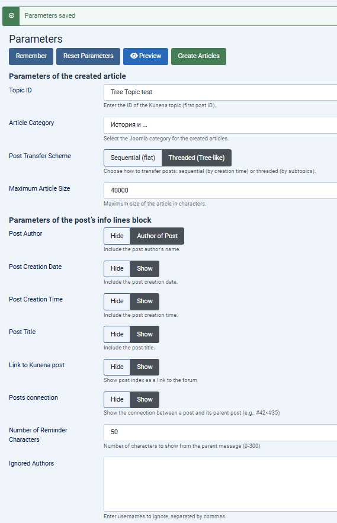
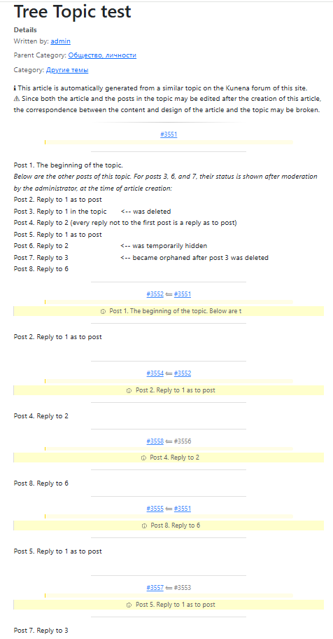
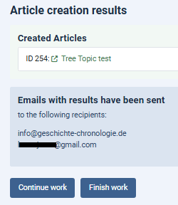

# Kunena Topic to Article

*Documentation in Russian:* [🇷🇺 Русский](docs/README.ru.md)

A component for automatically creating Joomla articles based on Kunena forum topics.
Developed for Joomla 5 and Kunena 6.x.

[📖 Post relations in Kunena, info block, parsing, languages](docs/FUNCTIONALITY.md) | [ℹ️ Emails about article creation, database encoding, plugin](docs/ADDITIONAL.md)

## 🚀 General Information

### 1.1. Purpose
The Kunena Topic to Article component (`kunenatopic2article`) automatically generates Joomla articles based on Kunena forum topics.
- ✅ Requires Joomla 5 and Kunena 6.x
- ✅ Works in the Joomla administrator area
- ✅ Tested on Joomla 5.4 / Kunena 6.3.10

### 1.2. Component Parameters

#### 📄 Created Article Parameters
- **Topic ID** (first post ID of the topic)¹
- **Article Category** (selected from a dropdown list of site article categories)
- **Post Transfer Scheme** (sequential or threaded), see section 7
- **Maximum Article Size** (number of characters, default 40000), see section 2.2

#### ℹ️ Post Info Block Parameters
(have "Hide" / "Show" values except for the last two)
- **Post Author** - determined by the topic
- **Post Creation Date** - taken from the post
- **Post Creation Time** - taken from the post
- **Post Title** - taken from the post²
- **Link to Kunena Post** - shows the post index as a link, see section 4.1
- **Post Relation** - shows the connection between a post and its parent post (e.g., #42 ⟸ #35)
- **Reminder Excerpt Length** - number of characters shown from the parent message (0-300)
- **Ignored Authors** - usernames (comma-separated) whose posts are not transferred to created articles

_¹ ID is displayed in the upper right corner of the post after the # sign when the "Show real post ID" option is enabled in Kunena  
² Currently, Kunena defines post title as "Topic Title" or RE:"Topic Title"_

#### 🎨 CSS Styles
Styles define the appearance of articles (default - almost standard) and the formatting of the info block.
The stylesheet `/media/com_kunenatopic2article/css/kun_p2a.css` can be edited in `com_kunenatopic2article.zip` or directly on the server without reinstalling the component.

### 1.3. Installation
1. Install the component from the `com_kunenatopic2article.zip` file through the Joomla extensions manager
2. The component will automatically create the `kunenatopic2article_params` table (one row) in the database
3. Additionally, a [precise positioning plugin](docs/ADDITIONAL.md#8-precise-positioning-plugin) is available, see section 8

## ⚙️ Basic Information About Component Operation

### 2.1. Component Management
When calling the component, four buttons are available:

| Button | Purpose |
|--------|---------|
| ✅ **Remember** | Validates and saves parameters |
| 🔄 **Reset Parameters** | Returns settings to defaults |
| 👁️ **Preview** | Shows the first two posts with the info block |
| 🚀 **Create Articles** | Generates one or more articles based on the topic |

> The "Preview" and "Create Articles" buttons are activated after successful parameter saving.

### 2.2. Article Creation
- The topic author is assigned as the article author
- The first article gets the title "Topic"
- When the size limit is exceeded, articles are created with numbering: "Topic. Part 2", "Topic. Part 3", etc.
- If a single post exceeds the maximum size, an article is created containing only that post

### 2.3. Service Lines
Information is placed at the beginning of each article:
- ℹ️ *"This article is automatically generated from a similar topic on the Kunena forum of this site."*
- ⚠️ *"Since both the article and the posts in the topic may be edited after the creation of this article, the correspondence between the content and design of the article and the topic may be broken."*

### 2.4. Post Filtering
Only the following are transferred to articles:
- Published posts (`hold = 0`)
- Posts by authors not listed in "Ignored Authors"

### 2.5. Post Info Block
Displayed before each post if at least one of its parameters is enabled. When all parameters are disabled, posts are separated by a subtle line. See section 4.

### 2.6. Markup Preservation
- All links are preserved
- "Bare" URLs (without explanatory text) are shortened to 50 characters
- Attachment images are copied as links to these attachments in Kunena folders
- See also section 5 [Parsing](docs/FUNCTIONALITY.md#5-parsing)

### 2.7. Example of an article based on the topic

## 📊 Article Creation Results

### 3.1. Execution Report
After processing the topic, the following are displayed:
- **Created Articles** - list with IDs and article names, as well as links to them
- **Emails Sent** - list of email addresses to which the component sent notifications about article creation. See also section 10.

### 3.2. Further Action Options
Below the article list, there are two buttons:
- **🔄 Continue Work** - opens the form with saved parameters (only Topic ID is reset)
- **🏁 Finish Work** - ends the current session

### 3.3. Connection Between Articles and Topic
Created articles and posts in the topic "live their own lives" after the component runs and can be edited independently. The exception is links in articles to post indices, if they were created. When clicking such a link, the corresponding post on the forum opens in a neighboring browser tab. _If a post is deleted after article creation, the link may stop working._

## 🙏 Acknowledgments

This component uses the [chriskonnertz/bbcode](https://github.com/chriskonnertz/bbcode) parser for BBCode to HTML conversion. Huge thanks to Chris Konnertz!

Of course, I am grateful to the **Kunena** developers, whose forum I use on my sites for many years.

## ✋ Support

If you like this project, you can make a donation via PayPal:

👉 paypal.me/lemiratGiCh

---

*[➡️ Post relations in Kunena, info block, parsing, languages](docs/FUNCTIONALITY.md)  
[➡️ Emails about article creation, database encoding, plugin](docs/ADDITIONAL.md)*
