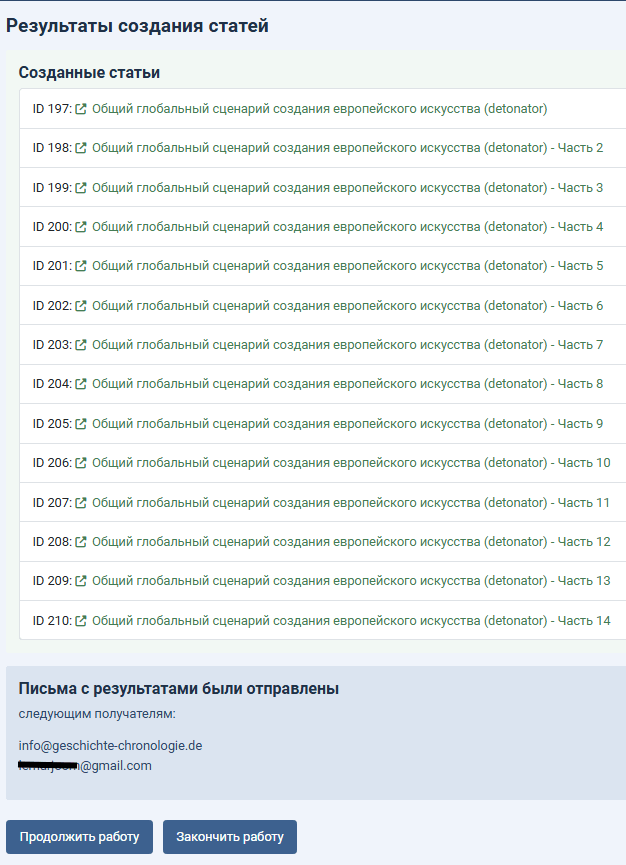

# Additional Information

[⬅️ Component purpose, parameters, installation, operation](../README.md) | [ℹ️ Post relations in Kunena, info block, parsing, languages](FUNCTIONALITY.md) | [ℹ️ Video Link Processing in the Component](VIDEOLINKS.md)

## 8. Precise Positioning Plugin

### 🎯 Problem Being Solved
When following internal links (to topic/post title or post index), Kunena usually positions the required post at the top of the screen. However, on large topics, especially with many images, precise positioning doesn't always work - Kunena stops "somewhere nearby".

### 💡 Optional Helper
The `plg_system_kunenatopic2articleimgfix` plugin is an optional helper. On large Kunena topics with many images it may improve scrolling to a post anchor after the page layout finishes changing.

The plugin cannot guarantee exact positioning in every case. The final result depends on Kunena output, browser behavior, image loading, the template, and other page scripts.

### 🚀 Application
- Install and enable the plugin only if your site has visible problems with post-anchor positioning.
- The plugin works independently of the main component.
- It can be useful for gallery and museum sites, product catalogs, and other image-heavy forums.

## 9. Database Encoding

- The component uses 4-byte Unicode characters
- Recommended encoding: `utf8mb4` (standard for current Joomla versions)
- Compatibility with `utf8mb3` - minor character display issues possible

## 10. Sending Emails About Article Creation

### Recipients
- Topic author
- Site administrator

### Mechanism
Sending occurs according to Joomla configuration settings via
SMTP, Sendmail, or PHP Mail. Joomla automatically uses the selected method.

When testing the component on a local server, for example Wampserver64, emails are not sent; the component displays a corresponding message.

## 11. Advice on PNG Images (not related to the component)

Old PNG files may have color profile issues affecting display in articles. Profiles of such images can be fixed with online tools like PNGcheck, ImageOptim, etc.

## 12. An example of the component in action
Creating 14 articles from a topic (using a tree scheme).

## ❓ Frequently Asked Questions

### ❓ Can created articles be edited?
✅ Yes, articles are regular Joomla materials and can be edited with standard tools.

### ❓ Is the connection between articles and the topic preserved after editing?
❌ Generally speaking - no, after creation the article and topic live independent lives. However, links in articles can be used to navigate to post indices in the forum, but even this connection can be broken if a post is deleted after article creation.

*[⬅️ Component purpose, parameters, installation, operation](../README.md) | [ℹ️ Post relations in Kunena, info block, parsing, languages](FUNCTIONALITY.md) | [ℹ️ Video Link Processing in the Component](VIDEOLINKS.md)*
