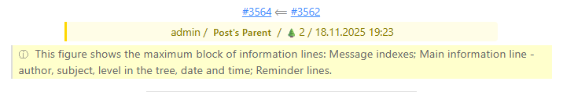
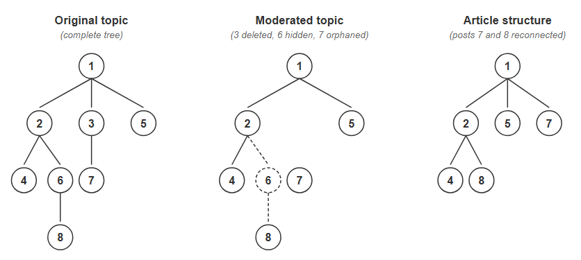

# Component Functionality

[⬅️ Component purpose, parameters, installation, operation](../README.md) | [ℹ️ Emails about article creation, database encoding, plugin](ADDITIONAL.md) | [ℹ️ Video Link Processing in the Component](VIDEOLINKS.md)(ADDITIONAL.ru.md)

## 4. Post Info Block

### 4.1. Block Structure
The complete post info block displays:

- **Post Indices** - as links to the forum
- **Main Information Line** - author, subject, tree level, date and time
- **Reminder Lines** - beginning of the previous message

> A tooltip "Beginning of the previous message" (in the component's language) appears when the user hovers the cursor over the reminder lines.


### 4.2. Reminder Lines Format
- Optimal length: 50-150 characters
- Format of links and images in reminder lines:

**Links:**
- With text: 🔗"Link text"🔗
- Without text: 🔗url🔗 (shortened to 40 characters)

**Images:**
- With non-empty alt text: 🖼️alt_text🖼️
- Without alt text: 🖼️filename.extension🖼️, for example, 🖼️Image1.png🖼️

**Video:**
- 📹video📹

> If a link or image exceeds the limit, information about them is still displayed in full.

### 4.3. Editing CSS embedded in articles
Styles are located inside the `<style>` tag in the article's HTML. The easiest way to view the article's CSS: open the article on the site, press "View page source" in the browser, and find the `kun_p2a` class.

**Editing CSS in an article:**
1. Open the article for editing in Joomla editor
2. Switch to "HTML" or "Source" mode
3. Find the `<style>...</style>` block and make changes

**⚠️ Important:** JCE and some other WYSIWYG editors may hide/remove `<style>` tags. Workarounds: 1) temporarily disable tag filtering in editor settings, 2) use the basic "None" editor, or 3) edit via phpMyAdmin (table `#__content`).

**Managing CSS size in articles**

The supplied CSS is ~10 KB and provides "beautiful" article formatting. For most sites, 10 KB per article is insignificant. However, if there are memory issues, the file size can be reduced to ~1 KB by removing decorative styles and unused elements, such as video player styles (approximately ~5 KB).

## 5. Parsing

Kunena BBCode is converted to Joomla HTML using the [chriskonnertz/bbcode](https://github.com/chriskonnertz/bbcode) parser. Huge thanks to the developer.

**Additional processing:**
- Processing of links, images and videos
- Shortening "bare" URLs
- Fixing problematic character sequences (e.g., `[br /`)

## 6. Language Files

**Supported languages:** English, German, Russian. Only the Russian text is authentic. English and German translations may require improvement. Code comments are made predominantly in Russian (you can contact the developer for explanations).

**Important localization constants:**
```
COM_KUNENATOPIC2ARTICLE_INFORMATION_SIGN_LENGTH=
COM_KUNENATOPIC2ARTICLE_WARNING_SIGN_LENGTH=
```
They contain the lengths of service lines specified in section 2.3. When adding new languages, it is recommended to recalculate the lengths in these lines (for correct operation of the **Maximum Article Size** parameter).

## 7. Post Relations in Kunena

### 7.1. Tree Structure (a bit of theory)
Currently, posts in a topic are displayed in chronological order.
However, Kunena also has deeper connections between posts:
  - a new post can be a reply in the topic
  - a new post can be a reply to a specific post
Thus, any topic has a tree structure of posts, reflecting the logical connections between them. (For forums with serious discussions and a large number of posts, the tree structure provides great convenience).

### 7.2. Transfer Schemes
The component supports two schemes for transferring posts to articles (determined by the "Post Transfer Scheme" parameter, see section 1.2):
- sequential (Flat) - posts are transferred in chronological order
- threaded (Tree) - the logical structure of the discussion is preserved

### 7.3. Handling Problematic Posts

7.3.1. A topic may contain temporarily hidden (hold = 2) posts. It may also have previously had posts that were deleted by the time the component runs.

7.3.2. In the sequential scheme, temporarily hidden posts are not transferred, deleted ones naturally are not either, and the rest (published) are transferred to articles.

7.3.3. In the threaded scheme, temporarily hidden posts break, and deleted posts cut off branches extending from them. To avoid losing posts from these branches, the following tree repair rules are adopted:
- Temporarily hidden posts contain information about their parents (parent field). An existing ancestor of a temporarily hidden post is assigned as the parent of its children.
- The situation is different with completely deleted posts. Information about their parents disappears along with them. To save cut-off branches, the component assigns the first post of the topic as the parent of the first posts of these branches.



7.3.4. If post index links are enabled in the parameters, the index of a temporarily hidden post is displayed as regular text (not a link). The index of a completely deleted post is replaced with the index of the first post of the topic, according to section 7.3.3.

*[⬅️ Component purpose, parameters, installation, operation](../README.md) | [➡️Emails about article creation, database encoding, plugin](ADDITIONAL.md) | [ℹ️ Video Link Processing in the Component](VIDEOLINKS.md)*
