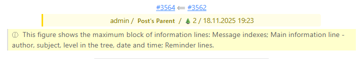
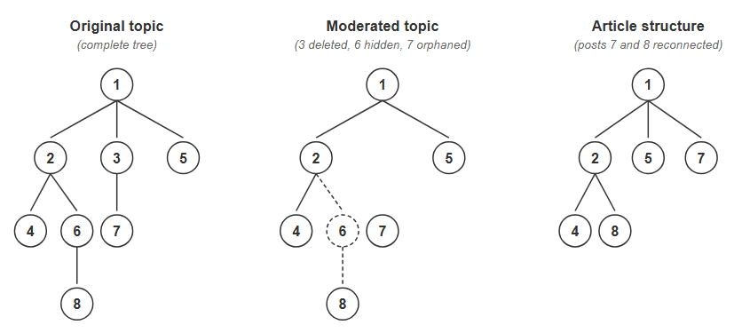

# Функциональность компонента

[⬅️ Назначение компонента, параметры, установка, функционирование](README.ru.md) | [ℹ️ Письма о создании статей, кодировка БД, плагин](ADDITIONAL.ru.md) | [ℹ️ Обработка ссылок на видео](VIDEOLINKS.ru.md)


## 4. Блок информационных строк

### 4.1. Структура блока

В полном блоке информационных строк показываются:

* **Индексы сообщений** - как ссылки на форум
* **Основная информационная строка** - автор, тема, уровень в дереве, дата и время
* **Строки напоминания** - начало предшествующего сообщения

> При наведении курсора на "строки напоминания" всплывает подсказка "Начало предшествующего сообщения" на языке компонента.



### 4.2. Вид строк напоминания

* Оптимальная длина: 50-150 символов
* Вид ссылок и изображений в строках напоминания:

**Ссылки:**

* С текстом: 🔗"Текст ссылки"🔗
* Без текста: 🔗url🔗 (укороченный до 40 символов)

**Изображения:**

* С непустым alt-текстом: 🖼️alt_текст🖼️
* Без alt-текста: 🖼️имя_файла.расширение🖼️, например, 🖼️Image1.png🖼️.

**Видео:**

* 📹видео📹

> Если ссылка или изображение выходят за лимит, информация о них все равно выводится целиком.

### 4.3. Редактирование встроенного в статью CSS

Стили находятся внутри тега <style> в HTML статьи. Простейший способ просмотра CSS: откройте статью на сайте, в браузере нажмите "Исходный код страницы" и найдите класс `kun_p2a`.

**Редактирование CSS в статье:**

1. Откройте статью для редактирования в редакторе Joomla
2. Переключитесь в режим "HTML" или "Источник"
3. Найдите блок <style>...</style> и внесите изменения
4. См. также замечание об инлайн-стилях в пункте 1.3 в README.ru.md

**⚠️ Важно:** JCE и некоторые другие WYSIWYG-редакторы могут скрывать/удалять теги <style>. Для обхода: 1) временно отключите фильтрацию тегов в настройках редактора, 2) используйте базовый редактор "None", или 3) редактируйте через phpMyAdmin (таблица `#__content`).

**Управление размером CSS в статьях**

Поставляемый CSS занимает ~10 КБ и обеспечивает "красивое" оформление статей. Для большинства сайтов 10 КБ на статью несущественны. Но если есть проблемы с памятью, размер этого файла можно сократить до ~1 КБ, удалив декоративные стили и неиспользуемые элементы, например, стили видеоплееров (примерно ~5 КБ).


## 5. Парсинг

BBCode Kunena преобразуется в HTML Joomla с использованием парсера [chriskonnertz/bbcode](https://github.com/chriskonnertz/bbcode). Огромная благодарность разработчику.

**Дополнительные обработки:**

* Обработка ссылок, изображений и видео
* Сокращение "голых" URL
* Исправление проблемных последовательностей символов (например, `[br /`)

## 6. Языковые файлы

**Поддерживаемые языки:** английский, немецкий, русский. Аутентичным является только русский текст. Английский и немецкий переводы могут требовать улучшения. Комментарии в коде сделаны преимущественно на русском языке (за объяснениями можно обращаться к разработчику).

**Важные константы для локализации:**

```
COM_KUNENATOPIC2ARTICLE_INFORMATION_SIGN_LENGTH=
COM_KUNENATOPIC2ARTICLE_WARNING_SIGN_LENGTH=
```

Они содержат длины служебных строк, указанных в п. 3.1. При добавлении новых языков рекомендуется пересчитать длины в этих строках (для корректной работы параметра **Максимальный размер статьи**).

## 7. Связи постов в Kunena

### 7.1. Древовидная структура (немного теории)

В настоящее время посты в теме отображаются в хронологическом порядке.
Однако в Kunena присутствуют и более глубокие связи между постами:

* новый пост может быть ответом в теме
* новый пост может быть ответом на конкретный пост.
Таким образом, в любой теме присутствует древовидная структура постов, отражающая логические связи между ними. (Для форумов с серьезными обсуждениями и большим количеством постов в них древовидная структура представляет большое удобство).

### 7.2. Схемы переноса

Компонент поддерживает две схемы переноса постов в статьи (определяются параметром "Схема переноса сообщений" (см. п. 1.2.1):

* последовательная (Flat) - посты переносятся в хронологическом порядке
* древовидная (Tree) - сохраняется логическая структура обсуждения

### 7.3. Обработка проблемных постов

7.3.1. В теме могут присутствовать временно скрытые (hold = 2) посты. Также в ней ранее могли быть посты, удаленные к моменту работы компонента.

7.3.2. В последовательной схеме временно скрытые посты не переносятся, удаленные, естественно, тоже, а остальные (опубликованные) переносятся в статьи.

7.3.3. В древовидной схеме временно скрытые посты надламывают, а удаленные посты отрезают отходящие от них ветки. Чтобы не терять посты из этих веток, приняты следующие правила ремонта дерева.

* Во временно скрытых постах имеется информация об их родителях (поле parent). Существующий предок временно скрытого поста назначается родителем его детей.
* С полностью удаленными постами ситуация иная. Вместе с ними исчезает и информация об их родителях. Чтобы спасти отрезанные ветки компонент назначает родителем первых постов этих веток первый пост темы.



7.3.4. Если в параметрах включен вывод ссылок для индексов постов, то индекс временно скрытого поста выводится как обычный текст (не ссылка). Индекс полностью удаленного  поста заменяется на индекс первого поста темы, согласно п. 7.3.3.

*[⬅️ Назначение компонента, параметры, установка, функционирование](README.ru.md) | [ℹ️ Письма о создании статей, кодировка БД, плагин](ADDITIONAL.ru.md) | [ℹ️ Обработка ссылок на видео](VIDEOLINKS.ru.md)*
